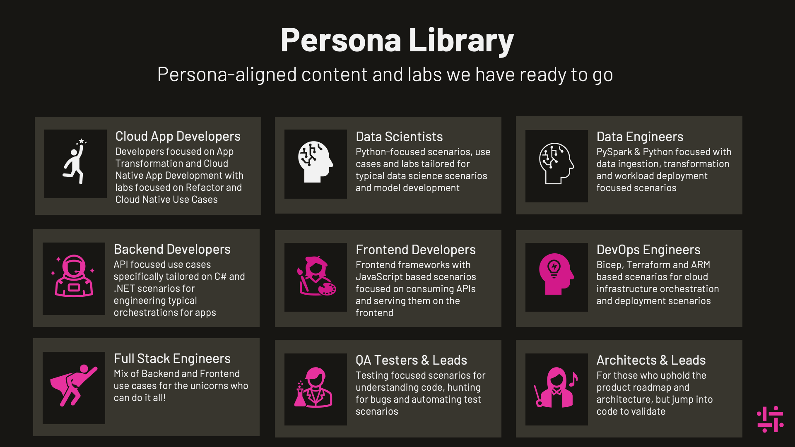

# GitHub Copilot Labs

Welcome to GitHub Copilot Labs! 🎉🚀

We are excited to have you join us!

Our labs are designed to immerse you in GitHub Copilot and enhance your coding journey through persona-specific tracks.
Whether you're a frontend developer, backend developer, full stack engineer, DevOps engineer, data engineer, or data scientist, we have something for you.

Dive in and explore the incredible world of GitHub Copilot! 🌟🤖

Here’s how to get started:

1. **Explore Our Labs**:Check out our curated list of workshops designed for different developer personas.
2. **Get Support**: Insight can help you with your GitHub Copilot adoption journey. Find out more by emailing us at [marketing-apac@insight.com](mailto:marketing-apac@insight.com?Subject=GitHub%20Copilot%20Adoption%20Help).
3. **Contribute**: Have suggestions for additional workshops or labs? Submit an Issue or PR, and we’ll consider adding them to our list!

Happy coding! 💻✨

### Frontend Developers

- [GitHub Copilot Workshop for Front-end developers](https://github.com/GitHub-Insight-ANZ-Lab/copilot-lab-weather-app-react) (React, Typescript, Javascript, CSS)

### Backend Developers

- [GitHub Copilot Hackathon ASP.NET Minimal API](https://github.com/GitHub-Insight-ANZ-Lab/copilot-hackathon-minimal-api-csharp) (C#, ASP.NET Core)
- [GitHub Copilot Hackathon Java Spring Boot](https://github.com/GitHub-Insight-ANZ-Lab/copilot-hackathon-java-spring-boot) (Java, Spring Boot)
- [GitHub Copilot Lab C# Console App](https://github.com/GitHub-Insight-ANZ-Lab/copilot-lab-music-store-csharp-console) (C#, .NET)
- [GitHub Copilot Lab Node Calculator](https://github.com/GitHub-Insight-ANZ-Lab/copilot-node-calculator) (Node.js)

### Full Stack Engineers

- [SPA Music Store with GitHub Copilot](https://github.com/GitHub-Insight-ANZ-Lab/copilot-lab-music-store-typescript) (Node.js Express, Next.js, TypeScript, HTML,
  CSS)
- [MVC Music Store with GitHub Copilot](https://github.com/GitHub-Insight-ANZ-Lab/copilot-lab-music-store-csharp) (C#, ASP.NET Core MVC, HTML, CSS)

### DevOps Engineers

- [GitHub Copilot Hackathon DevOps](https://github.com/GitHub-Insight-ANZ-Lab/copilot-hackathon-devops) (Azure, Terraform, Docker, GitHub Actions)

### Data Engineers

- [GitHub Copilot Hackathon for Python Data Engineer](https://github.com/GitHub-Insight-ANZ-Lab/copilot-hackathon-data-engineer-python) (Python, Jupyter Notebooks)
- [GitHub Copilot Lab for SQL](https://github.com/GitHub-Insight-ANZ-Lab/copilot-lab-sql) (SQL Database Development)

### Data Scientists

- [GitHub Copilot Hackathon for Python Data Scientist](https://github.com/GitHub-Insight-ANZ-Lab/copilot-hackathon-data-scientist-python) (Python, Jupyter Notebooks)
- [GitHub Copilot Lab in R](https://github.com/GitHub-Insight-ANZ-Lab/copilot-lab-r) (R for Statistical Computing)

---
